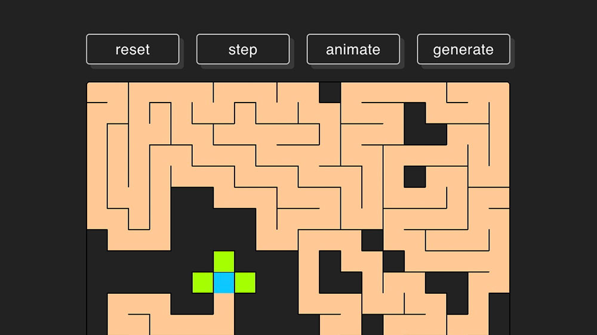

# Maze generator

## About

This demo uses a backtracking algorithm to create out a maze from a grid of cells. Each step of the algorithm checks a given cell's neighbors, randomly chooses one to visit, and then removes the "wall" between them. If there aren't any neighbors to visit, the algorithm steps back on the path until there are, and continues.

## Demo

See it in action on CodePen: https://codepen.io/andyranged/pen/PoLPGVB
